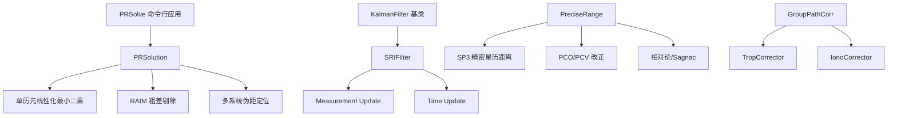
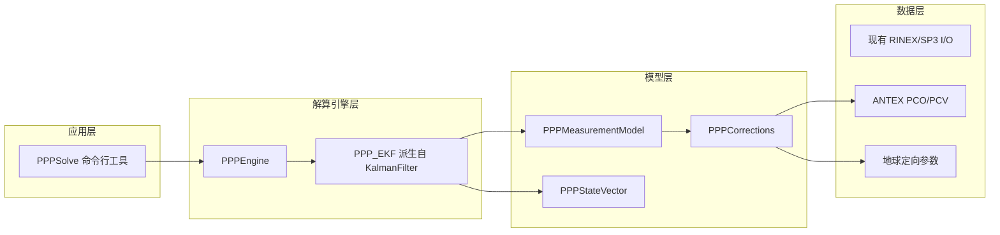

# GNSSTk PPP 解算软件改造计划

## 1. 目标与范围

基于现有 GNSSTk 工具包（PRSolve/PRSolution/KalmanFilter/SRIFilter/PreciseRange），改造实现支持多系统的 PPP 浮点解算引擎。

- **定位模式**：PPP-Float（浮点解，不固定模糊度）
- **观测模式**：消电离层组合（IF） + 非差非组合（UC）
- **支持系统**：GPS / BDS / Galileo / GLONASS / QZSS / IRNSS
- **估计方法**：扩展卡尔曼滤波（EKF），复用现有 [`KalmanFilter`](core/lib/Geomatics/KalmanFilter.hpp:136) / [`SRIFilter`](core/lib/Geomatics/SRIFilter.hpp:93)
- **预期精度**：浮点解 dm 级（水平 < 10cm，高程 < 20cm，收敛后）

---

## 2. 现有代码库架构分析



**关键复用资产**：
- **文件 I/O**：RINEX Obs/Nav/Met/Clk、SP3 读取（[`Rinex3ObsStream`](apps/positioning/PRSolve.cpp:228)、[`SP3Stream`](apps/positioning/PRSolve.cpp:246)）
- **星历与钟差**：[`NavLibrary`](apps/positioning/PRSolve.cpp:382) + [`MultiFormatNavDataFactory`](apps/positioning/PRSolve.cpp:384)
- **精密测距**：[`PreciseRange::ComputeAtTransmitTime`](core/lib/Geomatics/PreciseRange.hpp:103) 提供几何距离、卫星钟差、相对论、PCO/PCV
- **滤波框架**：[`KalmanFilter`](core/lib/Geomatics/KalmanFilter.hpp:136) 定义了 EKF 的接口（`defineInitial` / `defineMeasurements` / `defineTimestep` / `defineInterim`）
- **对流层模型**：[`NBTropModel`](apps/positioning/PRSolve.cpp:251)、[`NeillTropModel`](apps/positioning/PRSolve.cpp:252) 等

---

## 3. PPP 核心架构设计

### 3.1 模块层次



### 3.2 状态向量设计

状态向量维度随可见卫星动态变化，分为**全局状态**和**卫星相关状态**。

#### IF 消电离层组合模式

| 状态分量 | 维度 | 动态模型 | 说明 |
|---------|------|---------|------|
| dX, dY, dZ | 3 | 随机常数 | 接收机位置改正（ECEF） |
| dT_gps | 1 | 白噪声 / 随机游走 | GPS 接收机钟差 |
| dT_sys_i | N_sys-1 | 白噪声 / 随机游走 | 各系统与 GPS 的 ISB |
| ZWD | 1 | 随机游走 | 天顶湿延迟 |
| N_IF^j | N_sat | 随机常数 | 每颗卫星 IF 组合浮点模糊度 |

#### UC 非组合模式

| 状态分量 | 维度 | 动态模型 | 说明 |
|---------|------|---------|------|
| dX, dY, dZ | 3 | 随机常数 | 接收机位置改正 |
| dT_sys | N_sys | 白噪声 / 随机游走 | 每系统接收机钟差 |
| ZWD | 1 | 随机游走 | 天顶湿延迟 |
| I_1^j | N_sat | 随机游走 | 每颗卫星 L1 电离层延迟 |
| N_1^j, N_2^j | 2*N_sat | 随机常数 | 每颗卫星每频点浮点模糊度 |

> **注**：为了数值稳定性，实际实现中位置初始可用 SPP 结果作为先验，模糊度与电离层初值设为零。

### 3.3 观测方程设计

#### IF 模式（仅使用消电离层组合观测值）

```
P_IF = rho + c*(dT_r - dT_s) + Trop + eps_P
L_IF = rho + c*(dT_r - dT_s) + Trop + lambda_IF * N_IF + eps_L
```

- `P_IF`、`L_IF`：消电离层组合的伪距与载波相位
- `rho`：几何距离（由 [`PreciseRange`](core/lib/Geomatics/PreciseRange.hpp:73) 计算）
- `Trop`：对流层斜延迟 = `m_dry * ZHD + m_wet * ZWD`
- `N_IF`：IF 组合模糊度（浮点）

#### UC 模式（逐频点处理）

```
P_1 = rho + c*(dT_r - dT_s) + Trop + I_1 + eps_P1
P_2 = rho + c*(dT_r - dT_s) + Trop + gamma * I_1 + eps_P2
L_1 = rho + c*(dT_r - dT_s) + Trop - I_1 + lambda_1 * N_1 + eps_L1
L_2 = rho + c*(dT_r - dT_s) + Trop - gamma * I_1 + lambda_2 * N_2 + eps_L2
```

- `I_1`：L1 电离层斜路径延迟（作为状态估计）
- `gamma = (f1/f2)^2`

### 3.4 精密改正模型

PPP 精度高度依赖以下改正，需在 [`PreciseRange`](core/lib/Geomatics/PreciseRange.hpp:73) 基础上补充：

| 改正项 | 来源/方法 | 优先级 |
|-------|----------|--------|
| 卫星天线 PCO/PCV | ANTEX 文件（igs14.atx） | 必须 |
| 接收机天线 PCO/PCV | ANTEX 文件 + 类型匹配 | 必须 |
| 相位缠绕 Phase Windup | 卫星姿态模型计算 | 必须（仅相位） |
| 固体潮 Solid Earth Tide | IERS 2010 约定模型 | 必须 |
| 海洋潮汐负荷 Ocean Loading | BLQ 文件（可选） | 建议 |
| 极潮 Pole Tide | IERS 2010 约定模型 | 建议 |
| 地球自转 Sagnac | 已含于 [`PreciseRange`](core/lib/Geomatics/PreciseRange.hpp:179) | 已复用 |
| 相对论效应 | 已含于 [`PreciseRange`](core/lib/Geomatics/PreciseRange.hpp:132) | 已复用 |
| 卫星姿态偏航 | 正午/午夜机动模型 | 建议 |

---

## 4. 实现步骤（按优先级排序）

### Phase 1：基础框架与数据准备

- [ ] **Step 1.1** 创建 `core/lib/PPP/` 目录结构，规划头文件与实现文件
- [ ] **Step 1.2** 实现 `PPPStateVector` 类：封装状态向量、协方差、Namelist 映射，支持 IF/UC 两种状态布局
- [ ] **Step 1.3** 实现 `PPPMeasurementModel` 类：
  - 构建观测向量（伪距+载波，IF 或 UC）
  - 计算设计矩阵（Partials）：对位置、钟差、对流层、模糊度、电离层的偏导数
  - 构建测量噪声协方差矩阵
- [ ] **Step 1.4** 实现 `PPPCorrections` 类：
  - 封装 ANTEX 读取与 PCO/PCV 应用
  - 封装潮汐改正（固体潮、海洋负荷、极潮）
  - 封装相位缠绕改正
  - 统一接口：`applyCorrections(obs, sat, time, rxPos, ...)`

### Phase 2：扩展卡尔曼滤波引擎

- [ ] **Step 2.1** 实现 `PPP_EKF` 类（继承 [`KalmanFilter`](core/lib/Geomatics/KalmanFilter.hpp:136)）：
  - `defineInitial()`：初始化状态与协方差，先用 SPP 结果初始化位置
  - `defineMeasurements()`：按 IF 或 UC 模式填充观测、设计矩阵、测量噪声
  - `defineTimestep()`：构建状态转移矩阵 Phi（单位阵 + 随机游走项），过程噪声 Rw
  - `defineInterim()`：输出中间结果，检测收敛
- [ ] **Step 2.2** 实现状态转移逻辑：
  - 位置：随机常数（Phi=I, Rw=0）
  - 钟差：随机游走（每历元白噪声 ~ 1e-10 s^2）
  - ZWD：随机游走（~ 1-5 mm/sqrt(h)）
  - 电离层 UC：随机游走（~ 1-10 mm/sqrt(h)）
  - 模糊度：随机常数（Phi=I, Rw=0）
- [ ] **Step 2.3** 实现新卫星加入/旧卫星移除的动态状态扩缩（state augmentation / reduction）

### Phase 3：多系统与观测值处理

- [ ] **Step 3.1** 扩展 `PPPMeasurementModel` 支持多系统：
  - GPS：L1/L2/L5
  - BDS：B1I/B3I/B1C/B2a
  - Galileo：E1/E5a/E5b
  - GLONASS：G1/G2（频分多址，频率号依赖）
  - QZSS：L1/L2/L5
  - IRNSS：L5/S
- [ ] **Step 3.2** 实现 IF 组合生成器：按系统选择双频，生成 `alpha/beta` 系数
- [ ] **Step 3.3** 实现 UC 模式非组合观测提取：直接从 RINEX 读取各频点 PC/PL
- [ ] **Step 3.4** 实现 `PPPObsPreprocessor`：
  - 周跳探测（MW 组合、GF 组合、多项式拟合）
  - 粗差剔除（基于 IF 组合一致性）
  - 截止高度角过滤

### Phase 4：对流层增强与 ISB

- [ ] **Step 4.1** 实现 `PPPTropModel`：
  - 干延迟由 [`GlobalTropModel`](apps/positioning/PRSolve.cpp:250) / [`NeillTropModel`](apps/positioning/PRSolve.cpp:252) 固定计算
  - 湿延迟投影函数（GMF/GPT3/VMF1，先 GMF）
  - ZWD 作为 EKF 状态随机游走估计
- [ ] **Step 4.2** 实现多系统钟差与 ISB：
  - 基准系统（GPS）钟差 `dT_gps`
  - 其他系统 ISB = `dT_sys - dT_gps`
  - GLONASS IFB（频间偏差）可选支持

### Phase 5：应用与 I/O

- [ ] **Step 5.1** 创建 `apps/positioning/PPPSolve.cpp`，参考 [`PRSolve.cpp`](apps/positioning/PRSolve.cpp:1) 的命令行结构：
  - 输入：`--obs`、`--eph`（SP3）、`--clk`、`--ant`（ANTEX）、`--blq`（海洋负荷）
  - 模式选择：`--mode IF` 或 `--mode UC`
  - 系统选择：`--systems G,R,E,C,J,I`
  - 输出：`--out`（PPP 结果文件）
- [ ] **Step 5.2** 实现结果输出格式：
  - 位置 XYZ / NEU + 协方差
  - 接收机钟差（每系统）
  - ZTD / ZWD
  - 每颗卫星模糊度（IF 或 UC）
  - 每颗卫星电离层（UC 模式）
  - 残差序列

### Phase 6：测试与验证

- [ ] **Step 6.1** 单元测试：`PPPStateVector` 维度计算、`PPPMeasurementModel` Partials 数值导数验证
- [ ] **Step 6.2** 集成测试：使用 IGS 基准站（如 WTZZ、GMSD）24h 数据，对比 IGS 精密产品
- [ ] **Step 6.3** 精度评估：
  - 收敛时间（首次达到 < 20cm 3D）
  - 收敛后水平/高程 RMS
  - IF vs UC 模式对比

---

## 5. 关键接口草案

### 5.1 PPPStateVector

```cpp
class PPPStateVector {
public:
    // IF 模式构造函数
    PPPStateVector(size_t nSat, size_t nSys, Mode mode);
    
    // 状态索引映射
    size_t posIndex() const;           // 0
    size_t clkIndex(SatelliteSystem sys) const;
    size_t zwdIndex() const;
    size_t ambIndex(const SatID& sat) const;   // IF
    size_t ionoIndex(const SatID& sat) const;  // UC
    
    Vector<double> state;
    Matrix<double> cov;
    Namelist names;
};
```

### 5.2 PPP_EKF（继承 KalmanFilter）

```cpp
class PPP_EKF : public KalmanFilter {
public:
    int defineInitial() override;
    int defineMeasurements() override;
    void defineTimestep() override;
    int defineInterim() override;
    
    // PPP 特有
    void addSatellite(const SatID& sat);
    void removeSatellite(const SatID& sat);
    void setMode(Mode m) { mode = m; }
    
private:
    PPPStateVector sv;
    PPPMeasurementModel mm;
    PPPCorrections corr;
    Mode mode;
};
```

### 5.3 PPPCorrections

```cpp
class PPPCorrections {
public:
    bool loadAntex(const string& fn);
    bool loadOceanLoading(const string& fn);
    
    // 一次性应用所有改正到观测值
    double apply(double obs, const SatID& sat, const CommonTime& t,
                 const Position& rxPos, const string& obsType);
                 
    // 各分项（用于调试/输出）
    double getPCO(const SatID& sat, ...);
    double getPCV(const SatID& sat, ...);
    double getPhaseWindup(const SatID& sat, ...);
    double getSolidEarthTide(const Position& rxPos, const CommonTime& t);
};
```

---

## 6. 目录与文件规划

```
core/lib/PPP/
  PPPStateVector.hpp / .cpp
  PPPMeasurementModel.hpp / .cpp
  PPPCorrections.hpp / .cpp
  PPPObsPreprocessor.hpp / .cpp
  PPP_EKF.hpp / .cpp
  PPPTropModel.hpp / .cpp
  PPPConstants.hpp          // PPP 专用常数（如随机游走默认强度）
  
apps/positioning/
  PPPSolve.cpp              // 主程序
  PPPSolve.md               // 文档
```

---

## 7. 风险与应对

| 风险 | 影响 | 应对策略 |
|-----|------|---------|
| GLONASS FDMA 频率号处理复杂 | 中 | 复用 GLOfreqChannel 映射，UC 模式需按频率号分别计算波长 |
| BDS 多频点观测值选择混乱 | 中 | 按 RINEX 3 标准 obsType 自动匹配，默认 B1I+B3I |
| EKF 状态维度过大导致性能问题 | 中 | 采用稀疏矩阵优化（[`SparseMatrix`](core/lib/Geomatics/SRIFilter.hpp:59)），或按需扩缩状态 |
| 相位缠绕/潮汐模型精度不足 | 高 | 优先实现 IERS 2010 标准模型，使用 IGS 提供的 atl 文件 |
| 收敛慢（>30min） | 高 | 提供高质量初始位置（SPP），ZWD 初值用模型，钟差初值用 SPP |
| 周跳探测不完善导致滤波发散 | 高 | 多组合联合探测（MW+GF+TD），探测到周跳后重置对应模糊度状态 |

---

## 8. 验收标准

1. **功能**：PPPSolve 能读取 IGS 标准数据流（RINEX 3 Obs + SP3 + CLK + ATX），输出逐历元 PPP 解
2. **精度**：24h 静态数据，收敛后（>30min）水平 RMS < 5cm，高程 RMS < 10cm
3. **稳定性**：24h 连续运行无发散、无崩溃
4. **多系统**：至少支持 GPS+GAL+BDS 三系统联合解算
5. **模式**：IF 和 UC 两种模式均可运行，结果一致性 < 2cm
